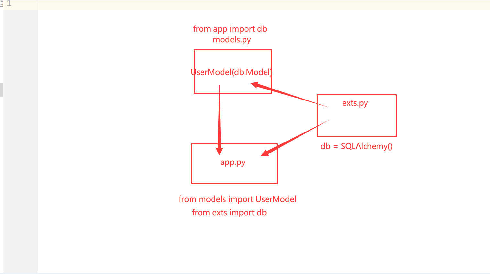

# flask_progress


# Flask小项目



解决循环

### **exts.py**

```python
# 解决循环运用
from flask_sqlalchemy import SQLAlchemy
from flask_mail import Mail
db = SQLAlchemy()
mail=Mail()

```

### models.py

```python
from datetime import datetime

from exts import db


class UserModel(db.Model):
    __tablename__ = 'user'
    id = db.Column(db.Integer, primary_key=True, autoincrement=True)
    username = db.Column(db.String(100), nullable=False)
    password = db.Column(db.String(1000), nullable=False)
    email = db.Column(db.String(100), nullable=False, unique=True)
    join_time = db.Column(db.DateTime, default=datetime.now)


```

### app.py

```python
import traceback

from flask import Flask, request, session, g, make_response, jsonify
from config import config
from blueprints.qa import qa
from blueprints.auth import bp

from exts import db, mail
from flask_migrate import Migrate
from tool.LogHandler import log
from models import UserModel, EmailCaptchaModel
from flask_cors import CORS

app = Flask(__name__)
cors = CORS(app, supports_credentials=True)
app.secret_key = 'CSaSvOU6h1iMb15s+GsV5TuKYSbREcBZ/g1Gjh9nCec='
# 设置session的过期时间
# app.config['PERMANENT_SESSION_LIFETIME'] = 1
#####################################################
# 导入自定义配置
app.config.from_object(config)
# 数据库初始化
db.init_app(app)
mail.init_app(app)


def set_global_exception_handler(app):
    @app.errorhandler(Exception)
    def unhandled_exception(e):
        response = dict()
        error_message = traceback.format_exc()
        app.logger.error("Caught Exception: {}".format(error_message))  # or whatever logger you use
        response["errorMessage"] = error_message
        log.error(response)
        # return response, 500


# set_global_exception_handler(app)
# 数据库迁移
migrate = Migrate(app, db)
################################################
# 蓝图注册
app.register_blueprint(qa)
app.register_blueprint(bp)


# 钩子函数
# hook before_request /before__first_request /after_request
# 每一次请求前执行
@app.before_request
def log_each_request():
    path = request.path
    if "static" not in path:
        log.debug('【请求方法】{}  【请求路径】{}  【请求地址】{}'.format(request.method, request.path, request.remote_addr))

@app.errorhandler(Exception)
def handle_error(Exception):
    log.error(f"Caught Exception: {Exception}")


@app.errorhandler(404)
def not_found(error):
    return make_response(jsonify({'code': '404', 'msg': '接口不存在'}), 404)


@app.errorhandler(400)
def par_err(error):
    return make_response(jsonify({'code': '400', 'msg': '请求参数不合法'}), 400)


@app.route('/actuator/health', methods=['GET', 'HEAD'])
def health():
    return jsonify({'online': True})


# 蓝图  电影模块，音乐模块，读书模块
if __name__ == '__main__':
    log.info('项目已经启动')
    app.run(host="0.0.0.0", port=5010, debug=True)

```


## flask-migrate

```bash
pip3 install Flask-Migrate

初始化(只需要执行一次)
flask db init
生成文件
flask db migrate
迁移数据库
flask db upgrade

记得
只需要在 app.py 中导入 models.py 中的类即可。

而且导入全部和导入一个，结果都是可以对所有的表进行创建。

```
## 消息闪现

```python
from flask import flash


                flash("密码错误！", "err")
            flash("添加标签" + data["name"] + "成功!", "ok")
    

    
    
        
            <p class="login-box-msg" style="color:red;">{{ msg }}</p>
        
        
            <p class="login-box-msg " style="color:green;">{{ msg }}</p>
        
```


## 登录装饰器

```python
from functools import wraps


def admin_login_req(f):
    @wraps(f)
    def decorated_function(*args, **kwargs):
        if "admin" not in session: #判断session 是否有值。如果没有值跳转登录页面
            return redirect(url_for("admin.login", next=request.url)) #，重定向到了名为 admin.login 的路由函数，并且将当前请求的 URL 作为 next 参数传递给该函数。这意味着，在用户完成登录后，会被重定向回原来的请求页面。
        return f(*args, **kwargs)

    return decorated_function


def login_requir(func):
    @wraps(func)  # 保留源信息，本质是endpoint装饰，否则修改函数名很危险
    def inner(*args, **kwargs):  # 接收参数，*args接收多余参数形成元组，**kwargs接收对于参数形成字典
        if g.user:
            return func(*args, **kwargs)
        else:
            return redirect(url_for("auth.login"))  # 没有登录就跳转到登录路由下

    return inner

```

## 全局变量

```bash
from flask import Flask, request, session, g, make_response, jsonify

@app.before_request
def my_session():
    if request.endpoint in ("auth", "static"):
        return
    else:
        user_id = session.get('user_id')
        if user_id:
            user = UserModel.query.get(user_id)
            setattr(g, "user", user)
        else:
            setattr(g, "user", None)

这段代码是一个Flask应用中的钩子函数（hook function），用于在每个请求到达视图函数（endpoint）之前，检查用户的登录状态并把当前用户的信息保存在全局对象g中。具体地，这个钩子函数会在每个请求到达之前被调用，然后它会检查当前请求的endpoint是否是"auth"或者"static"。如果是，那么就不需要执行后面的操作，直接返回即可。如果不是，那么就需要检查用户是否已经登录，如果已经登录，则把当前用户的信息查询出来，并把它保存在全局对象g的属性"user"中。如果用户没有登录，则把g对象的"user"属性设为None。


@bp.route("/login", methods=["POST", "GET"])
def login():
    if request.method == "GET":
        if g is None:
            return redirect("/")
        return render_template("login.html")
     else:
     	print("登录判断")


# 上下文处理器 ,返回所有模板可以使用
@app.context_processor
def my_context_processor():
    return {"user": g.user}
g.user 是 Flask 提供的一种全局变量，用于存储当前请求的用户信息。在这里，my_session 函数已经在 g.user 中设置了用户信息，因此可以通过 g.user 获取当前用户的信息。在上下文处理器中，g.user 会被添加到模板上下文中，使得模板可以使用它。

具体来说，模板中可以通过 {{ user }} 访问当前用户的信息，例如：{{ user.username }} 可以访问当前用户的用户名。
```

## 跨域

```python

from flask_cors import CORS


app = Flask(__name__)
cors = CORS(app, supports_credentials=True)


@app.after_request
def after(resp):
    '''
    被after_request钩子函数装饰过的视图函数
    ，会在请求得到响应后返回给用户前调用，也就是说，这个时候，
    请求已经被app.route装饰的函数响应过了，已经形成了response，这个时
    候我们可以对response进行一些列操作，我们在这个钩子函数中添加headers，所有的url跨域请求都会允许！！！
    '''
    resp = make_response(resp)
    resp.headers['Access-Control-Allow-Origin'] = '*'
    resp.headers['Access-Control-Allow-Methods'] = 'GET,POST'
    resp.headers['Access-Control-Allow-Headers'] = 'x-requested-with,content-type'
    return resp

```


## flask-wtf

表单验证：flask-wtf :wtforms
```bash
pip install flask-wtf

```

### 方法一

```python

import wtforms
from wtforms.validators import Email, Length, EqualTo, InputRequired

from exts import db
from models import UserModel, EmailCaptchaModel


# Form :主要验证用来验证前端提交的数据是否符合要求
class RegisterForm(wtforms.Form):
    email = wtforms.StringField(validators=[Email(message="邮箱格式错误！")])
    captcha = wtforms.StringField(validators=[Length(max=4, min=4, message="验证码格式错误")])
    username = wtforms.StringField(validators=[Length(min=3, max=20, message="用户格式错误")])
    password = wtforms.StringField(validators=[Length(min=6, max=20, message="密码格式错误")])
    password_confirm = wtforms.StringField(validators=[EqualTo("password", message="两次密码不一致")])

    # 自定义验证
    # 1、 邮箱是否被注册
    def validate_email(self, field):
        email = field.data
        user = UserModel.query.filter_by(email=email).first()
        if user:
            raise wtforms.ValidationError(message="该邮箱已经被注册！")

    # 2、 验证码是否正确

    def validate_captcha(self, field):
        captcha = field.data
        email = self.email.data
        filters = {'email': email, 'captcha': captcha}
        captcha_model = EmailCaptchaModel.query.filter_by(**filters).first()

        # print(email,captcha,captcha_model.email)
        if not captcha_model:
            raise wtforms.ValidationError(message="邮箱或者验证码错误")
        # tode 可以删除 captcha_model
        else:
            # 使用完毕可以删除 或者 定义是否使用  # False是0,true是1
            # db.session.delete(captcha_model)
            # db.session.commit()
            captcha_model.used = 1
            db.session.commit()


```

后端调用

```python
@bp.route("/login", methods=["POST", "GET"])
def login():
    if request.method == "GET":
        if g is None:
            return redirect("/")
        return render_template("login.html")
    else:
        form = LoginForm(request.form)
        if form.validate():
            email = form.email.data
            password = form.password.data
            user = UserModel.query.filter_by(email=email).first()
            if not user:
                return jsonify({'code': 200, 'message': '用户不存在'})
            if check_password_hash(user.password, password):
                # return jsonify({'code': 200, 'message': '用户登录成功'})
                # cookie  不适合存储太多数据，只适合存储少量的数据
                # seesion
                session["user_id"] = user.id
                flash(f"用户：{user.username} 登录成功")
                return redirect("/")
            else:
                return redirect(url_for("auth.login"))
        else:
            log.error(form.errors)
            return redirect(url_for("auth.login"))

```

### 方法二

```python
from flask_wtf import FlaskForm

from wtforms import StringField, PasswordField, SubmitField, FileField, TextAreaField, SelectField, \
    SelectMultipleField  # 字符串 和密码 表单提交的字段
from wtforms.validators import DataRequired, ValidationError, Length


class LoginForm(FlaskForm):
    """
    管理员登录表单
    """
    account = StringField(
        label="账号",
        validators=[
            DataRequired("请输入账号！")
        ],
        description="账号",
        render_kw={
            "class": "form-control",
            "placeholder": "请输入账号！",
            "required": "required"
        }
    )

    pwd = PasswordField(
        label="密码",
        validators=[
            DataRequired("请输入密码！")
        ],
        description="密码",
        render_kw={
            "class": "form-control",
            "placeholder": "请输入密码！",
            "required": "required"
        }
    )

    submit = SubmitField(
        "登录",
        render_kw={
            "class": "btn btn-primary btn-block btn-flat",

        }
    )

    def validate_account(self, field):
        account = field.data
        admin = Admin.query.filter_by(name=account).count()
        if admin == 0:
            raise ValidationError("账号不存在！")

```

#### 后端调用

```python
# 登录
@admin.route("/login/", methods=["GET", "POST"])
def login():
    get_ip = get_request_ip()
    form = LoginForm()
    if request.method == "POST":
        if form.validate_on_submit():
            data = form.data
            log.info(f'用户数据： {data}')
            admin = Admin.query.filter_by(name=data['account']).first()
            log.info(f'sql查询的的数据： {admin.name}')

            if not admin.check_pwd(data['pwd']):
                flash("密码错误！", "err")
                log.error(f"用户 ：{data['account']} 的密码输入错误")
                return redirect(url_for("admin.login"))
            log.info(f"用户: {data['account']} 登录成功，使用IP：{get_ip}")
            session["admin"] = data["account"]
            session["admin_id"] = admin.id
            # session.permanent = True
            adminlog = Adminlog(
                admin_id=admin.id,
                ip=request.remote_addr,
            )
            log.info(f" ----------------记录操作日志--------------------")
            db.session.add(adminlog)
            db.session.commit()
            log.info(f"-----------------操作日志保存入库--------------------")
            return redirect(request.args.get("next") or url_for("admin.index"))
    log.info(f"用户数访问登录 页面，IP：{get_ip}")
    return render_template("admin/login.html", form=form)


```

#### 前端调用

```python

    <div class="login-box-body">
        
            <p class="login-box-msg" style="color:red;">{{ msg }}</p>
        
        
            <p class="login-box-msg " style="color:green;">{{ msg }}</p>
        
        <form method="POST" id="form-data">
            <div class="form-group has-feedback">
                {{ form.account }}
                <span class="glyphicon glyphicon-envelope form-control-feedback"></span>
                
                    <div class="col-md-12">
                        <font style="color:red">{{ err }}</font>
                    </div>
                
            </div>
            <div class="form-group has-feedback">
                {{ form.pwd }}
                <span class="glyphicon glyphicon-lock form-control-feedback"></span>
                
                    <div class="col-md-12">
                        <font style="color:red">{{ err }}</font>
                    </div>
                
            </div>
            <div class="row">
                <div class="col-xs-8">
                </div>
                <div class="col-xs-4">
                    {{ form.submit }}
                    {{ form.csrf_token }}
                </div>
            </div>
        </form>
    </div>
```

